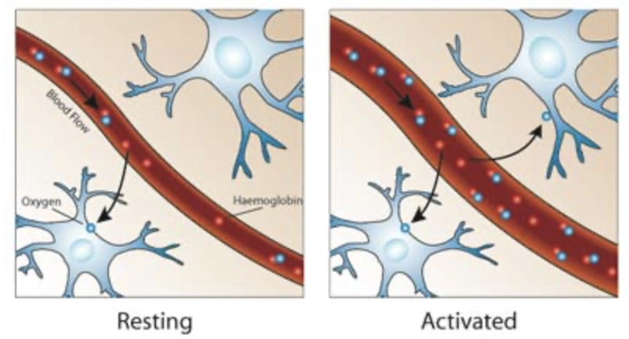
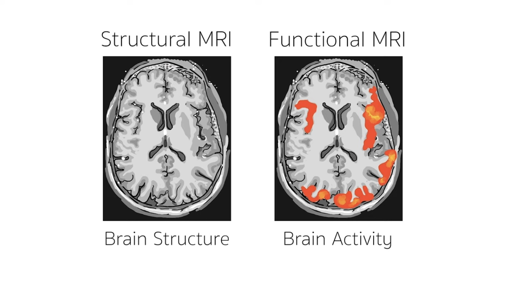
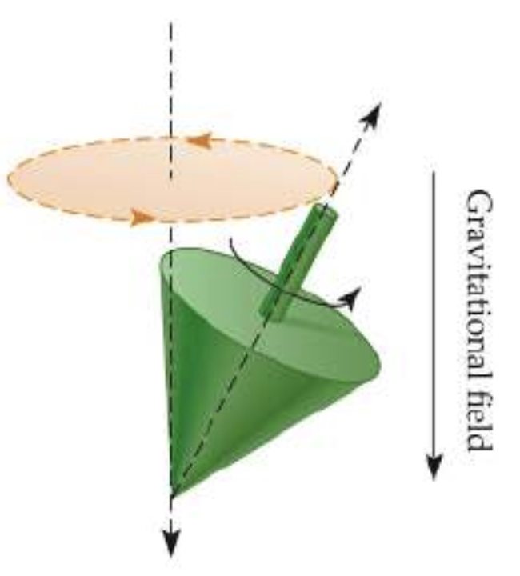
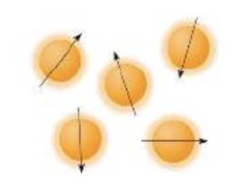
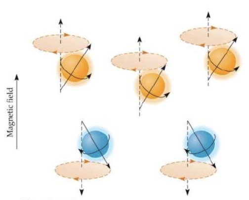
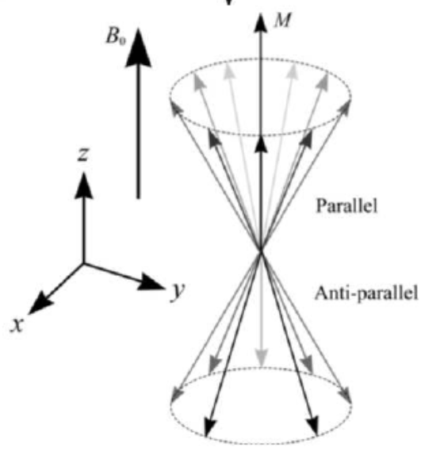
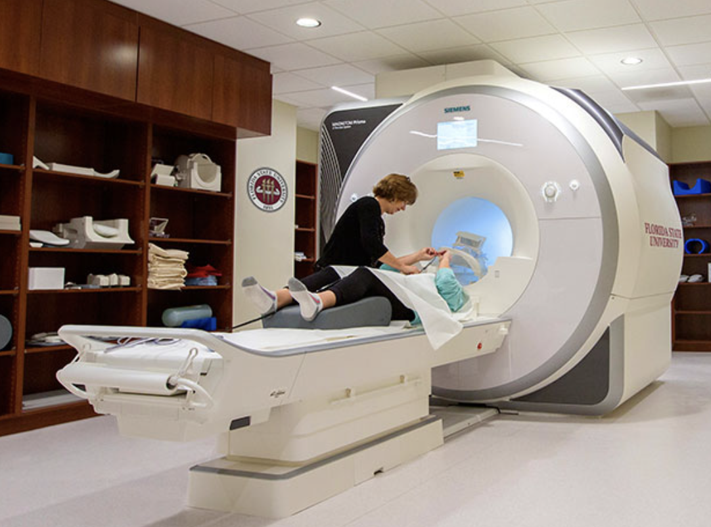
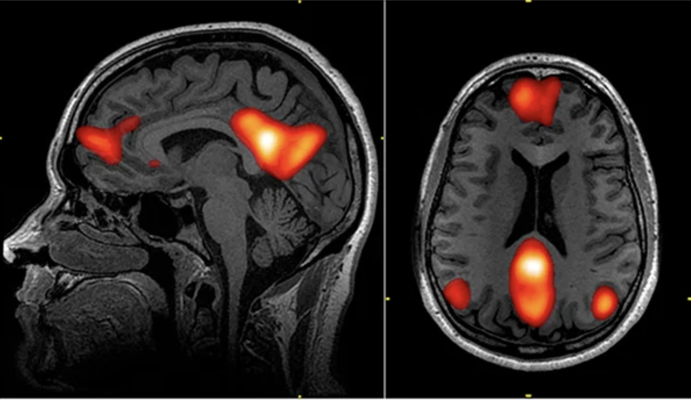
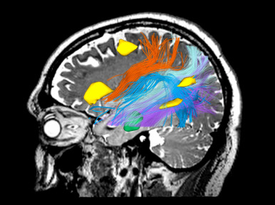

# PStA

# functional magnetic resonance imaging  (fMRI)

# Structure

---

# I. Introduction

### A. Introduction to the Topic and Motivation

# **II. Fundamentals of Functional Magnetic Resonance Imaging (fMRI)**

### A. ****Functioning**** of fMRI Imaging

### B. Differences between structural and functional MRI

### C. Physical principles of fMRI

# III. Technical aspects of fMRI Devices

### A. Device structure and functions

# IV. Data analysis in fMRI

### A. Imaging process

### B. Data analysis and interpretation of results

# V. Applications of fMRI in Neuro-Oncology and Radiotherapy

### A. Clinical applications

# VI. Conclusion

### A. Summary of Key Findings

### ****B. Outlook on the future significance of fMRI****

# I. Introduction

### A. Introduction to the Topic and Motivation

Thoughts, emotions, intelligence and even consciousness - all these phenomena take place in our brain ([https://www.youtube.com/watch?v=Rb_mdzgw-Jc](https://www.youtube.com/watch?v=Rb_mdzgw-Jc)). Although it accounts for only about 2% of body weight, the brain consumes more than 20% of total energy and oxygen intake. ([https://inside.hochdorf.com/de/fakten-ueber-unser-gehirn#:~:text=Das Gehirn eines Erwachsenen macht,DHA aus%2C 15%25 AA](https://inside.hochdorf.com/de/fakten-ueber-unser-gehirn#:~:text=Das%20Gehirn%20eines%20Erwachsenen%20macht,DHA%20aus%2C%2015%25%20AA)). It is an amazing marvel and the most powerful computer on the planet.

But how does this fascinating organ actually work?

For a long time, scientists had no way of looking into an active brain. Imagine the enormous advantages we would have if we could. Not only could we develop significantly more powerful computers or create new treatment methods for mental illnesses, but we could also answer fundamental questions like: Who are we? What defines us as human beings?  ([https://www.youtube.com/watch?v=Rb_mdzgw-Jc](https://www.youtube.com/watch?v=Rb_mdzgw-Jc))

It wasn't until 1991 that scientists invented a method that allows you to study the brain in an active state ([https://pubmed.ncbi.nlm.nih.gov/27432660/#:~:text=Abstract,basic and applied neuroscience research](https://pubmed.ncbi.nlm.nih.gov/27432660/#:~:text=Abstract,basic%20and%20applied%20neuroscience%20research)). This groundbreaking method revolutionized the understanding of the brain and opened completely new perspectives for exploring neural activities.

This paper focuses on an imaging technique that enables just that - functional magnetic resonance imaging (fMRI). With fMRI, it became possible to understand the functionality of each brain region and gain insights into neural activities.

In the following, the basics of this technology will be examined, including how fMRI imaging works and physical principles. In addition, the technical aspects of fMRI devices will be briefly discussed and data analysis will be explained in more detail. Finally, its practical applications are explored and a brief outlook on the importance of fMRI in the future is given.

The aim of this work is to provide a solid understanding of the imaging technique fMRI and demonstrate its significance in various fields.

# II. Fundamentals of functional Magnetic Resonance Imaging (fMRI)

### A.  Functioning of fMRI imaging

Functional Magnetic Resonance Imaging (fMRI) allows us to gain valuable insights into the functioning of the brain and a deeper understanding of human nature. By visualizing neural activities in the brain, fMRI enables the exploration of the foundations of thoughts, emotions, intelligence, and consciousness.

This section explains how functional magnetic resonance imaging works and explores how this method provides valuable insights into the workings of the brain. The basic operation of fMRI imaging is based on the relationship between neuronal activity and the resulting changes in local blood flow in the brain. When specific regions of the brain are active, there is a localized shortage of oxygen in those regions. This oxygen deficit is then countered, leading to an increased concentration of oxygenated blood in the active regions. The following diagram illustrates this process in a simplified manner. This increased oxygen concentration is considered an indicator of neuronal activity. (Medical Imaging Systems.pdf 6.4.4) ([https://www.youtube.com/watch?v=4UOeBM5BwdY](https://www.youtube.com/watch?v=4UOeBM5BwdY))

(Fig. 1: VL-Skript Part 2: 33- [https://www.win.ox.ac.uk](https://www.win.ox.ac.uk/))

As mentioned earlier, the demand for oxygen and nutrients increases when neuronal regions become more active. In response, cerebral blood flow and blood volume increase in these regions to meet the increased metabolic demands. In the figure, this phenomenon is illustrated by a wider blood flow and a higher number of Oxygen. This increased blood flow leads to an increased amount of oxygen-rich hemoglobin, resulting in a specific pattern of magnetic resonance signals that can be detected and measured.

To measure this increased concentration, the Blood Oxygen Level Dependent (BOLD) effect is used, which describes the different magnetic properties of oxygenated and deoxygenated hemoglobin. These differences affect the relaxation time T2*. The relaxation time T2* indicates the amount of time required for the magnetic signal to decay after excitation.

High concentrations of oxygenated hemoglobin in the blood result in a higher T2* signal intensity because there is less dephasing due to local magnetic field inhomogeneity. (Medical Imaging Systems.pdf 368 / Medical Imaging Systems.pdf 6.4.4)

Dephasing refers to the disruption of the magnetic field around the spins of oxygenated or deoxygenated hemoglobin. When the spins are out of phase or alignment, it leads to a decrease in signal intensity and makes it difficult to accurately detect neuronal activity. High concentrations of oxygenated hemoglobin reduce dephasing, resulting in higher signal intensity and improved imaging.

In simpler terms, when there is more oxygenated hemoglobin in the blood, the T2*-weighted image exhibits stronger signal intensity as there is less disturbance in the local magnetic field.

To measure neuronal activity due to an external stimulus/stimulus, resting state images are compared to images acquired during stimulation. In this way, changes in local oxygen concentration in different brain regions can be identified. A gradient echo (GRE) sequence is often used to generate T2*-weighted images. However, because differences in T2* signal intensity can be small, multiple resting-state images and images are usually acquired during stimulation to obtain reliable results. A statistical test is then performed to determine if there is a significant difference in the intensity of a particular pixel in the two sets of images. (Medical Imaging Systems.pdf 6.4.4)

This technique is based on the principles of magnetic resonance imaging (MRI), a non-invasive technique.

### B. Differences between structural and functional MRI

Basically, there are many different forms of MRI. A rough distinction can be made between structural and functional MRI ([https://www.youtube.com/watch?v=eN-zCoI_Ejc&t=34s](https://www.youtube.com/watch?v=eN-zCoI_Ejc&t=34s) - from minute 17). Structural MRI examines the anatomy as well as the pathology of the brain ([https://www.ed.ac.uk/clinical-sciences/edinburgh-imaging/research/themes-and-topics/medical-physics/imaging-techniques/structural-mr](https://www.ed.ac.uk/clinical-sciences/edinburgh-imaging/research/themes-and-topics/medical-physics/imaging-techniques/structural-mr)). This includes, for example, the examination of the existing amount of gray as well as white matter in the human brain ([https://www.youtube.com/watch?v=eN-zCoI_Ejc&t=34s](https://www.youtube.com/watch?v=eN-zCoI_Ejc&t=34s) - from minute 17).

Thus, constant features are considered here. These are recorded with the help of a snapshot.
It focuses on capturing and analyzing the current changes in brain activity resulting from different activities. Basically, a kind of film is created here by recording numerous images. These images are played rapidly, one after another, to reveal the changes in activity in various brain regions. These changes become visible over time, making it possible to draw conclusions about the particular tasks that the patient has performed. ([https://www.youtube.com/watch?v=eN-zCoI_Ejc&t=34s](https://www.youtube.com/watch?v=eN-zCoI_Ejc&t=34s) - from minute 17)

The end result is an image that represents the different regions of the brain and their activity during the examination. Coloring highlights the activities and makes them apparent to the viewer, compare figure two. Both of these techniques provide images that can be used for clinical radiological reporting as well as targeted analysis.

****(****[https://psychcentral.com/lib/what-is-functional-magnetic-resonance-imaging-fmri?c=1188759824#definition](https://psychcentral.com/lib/what-is-functional-magnetic-resonance-imaging-fmri?c=1188759824#definition))

 (https://www.ed.ac.uk/clinical-sciences/edinburgh-imaging/research/themes-and-topics/medical-physics/imaging-techniques/structural-mr)

(Fig. 2: [https://www.youtube.com/watch?v=4UOeBM5BwdY](https://www.youtube.com/watch?v=4UOeBM5BwdY))

The next section looks in more detail at the physical basis of fMRI imaging in order to develop a solid understanding of how this technology works.

### C. Physical principles of fMRI

To understand the physical principles of fMRI, the properties of atomic nuclei are first considered.

 
 
Atomic nuclei, such as protons, have an angular momentum called nuclear spin ([http://www.fmri-easy.de/physik.htm](http://www.fmri-easy.de/physik.htm)). This nuclear spin generates a magnetic moment.
 
 

<em>Fig. 3</em>

<em style="float: right;">Fig.4</em>
 

 
 

Under normal environmental conditions, nuclear spins are randomly aligned and balance each other out, causing the average magnetization (M) to approach zero. This net magnetization as well as the alignment of the spins can be seen in the figure shown (Fig.4).

 

Due to the action of a strong magnetic field, as generated in the fMRI scanner, more on this in a later chapter, the spins change their orientation. "The behavior of spins in the magnetic field is similar to a gyroscope in a gravitational field" (see [https://www.studocu.com/de/document/georg-august-universitat-gottingen/behaviorale-neurowissenschaften/vorlesung-31-physikalische-grundlagen-der-mr-bildgebung-teil-1/35525085](https://www.studocu.com/de/document/georg-august-universitat-gottingen/behaviorale-neurowissenschaften/vorlesung-31-physikalische-grundlagen-der-mr-bildgebung-teil-1/35525085) Lecture 3: Fundamentals of MR Imaging (Part 1) page 15).

There are two possible states: the low energy state (parallel alignment) and the high energy state (anti-parallel alignment) to the magnetic field. In the following image, the parallel states are shown in orange and the anti-parallel states are shown in blue ([https://www.studocu.com/de/document/georg-august-universitat-gottingen/behaviorale-neurowissenschaften/vorlesung-31-physikalische-grundlagen-der-mr-bildgebung-teil-1/35525085](https://www.studocu.com/de/document/georg-august-universitat-gottingen/behaviorale-neurowissenschaften/vorlesung-31-physikalische-grundlagen-der-mr-bildgebung-teil-1/35525085) Lecture 3: Fundamentals of MR Imaging (Part 1) page 14).

Fig. 5

fMRI uses hydrogen nuclei (protons), which are abundant in water and other tissues. As explained earlier, these protons align under the influence of the strong magnetic field in the fMRI scanner. By applying additional magnetic field gradients, differences in magnetization can be produced that correlate with neuronal activity. It is important to note that the overall vector of magnetization (indicated in Fig. 6
denoted by arrow M) is measured and not the magnetization of individual atomic nuclei.

Fig. 6

Therefore, the measurement primarily focuses on changes in net magnetization. This is composed of the longitudinal and the transverse component. The longitudinal component, which is aligned either parallel or antiparallel to the static magnetic field, is not measured directly but is mainly influenced by the static magnetic field. The transverse component, on the other hand, is recorded in the MR device and is oriented perpendicular to the direction of the static magnetic field.

Under normal conditions, the value of the transverse component is zero because, as mentioned earlier, the spins balance in the transverse direction and do not produce any measurable magnetization. A measurable change in the transverse plane occurs only when the precession of the spins is in phase. The net magnetization (M) in the longitudinal direction is proportional to the difference between the number of spins in the parallel and antiparallel states. When there are more spins in the parallel state, the net magnetization is larger. ([https://www.studocu.com/de/document/georg-august-universitat-gottingen/behaviorale-neurowissenschaften/vorlesung-31-physikalische-grundlagen-der-mr-bildgebung-teil-1/35525085](https://www.studocu.com/de/document/georg-august-universitat-gottingen/behaviorale-neurowissenschaften/vorlesung-31-physikalische-grundlagen-der-mr-bildgebung-teil-1/35525085) Lecture 3: Fundamentals of MR Imaging (Part 1) page 15).

The changes in neuronal activity in the brain lead to changes in blood flow and oxygenation. As already known, these changes affect the local concentration of oxygenated hemoglobin, which in turn affects the T2* signal intensity.

It is important to note that explanations of MRI phenomena often switch between classical physics and quantum mechanics, as both levels of description are used to explain the observed phenomena. Using both theories allows for a more comprehensive understanding of MRI phenomena, as George Box affirms, "All models are wrong but some are useful" (George Box). ([https://www.studocu.com/de/document/georg-august-universitat-gottingen/behaviorale-neurowissenschaften/vorlesung-31-physikalische-grundlagen-der-mr-bildgebung-teil-1/35525085](https://www.studocu.com/de/document/georg-august-universitat-gottingen/behaviorale-neurowissenschaften/vorlesung-31-physikalische-grundlagen-der-mr-bildgebung-teil-1/35525085) Lecture 3: Fundamentals of MR Imaging (Part 1) Page 13)

In summary, fMRI is based on using the magnetic properties of atomic nuclei and changes in blood flow to measure brain activity. These physical principles form the basis for the fMRI imaging technique and enable the study of neural processes in the brain.
Simply put, fMRI uses magnetism and blood flow to explore how the brain works ([http://www.fmri-easy.de/physik.htm](http://www.fmri-easy.de/physik.htm)).

The next sections explore the technical aspects of fMRI, including the equipment used, data acquisition, and data analysis methods.

# III. Technical aspects of fMRI Devices

### A. Device structure and functions

Functional magnetic resonance imaging (fMRI) uses special MRI scanners that generate strong magnetic fields. These devices are critical for acquiring the fMRI signals that provide information about brain activity. The following image shows one such MRI scanner.

(Fig. 7: [https://news.fsu.edu/news/science-technology/2016/10/24/fsu-unveils-floridas-advanced-mri-machine/](https://news.fsu.edu/news/science-technology/2016/10/24/fsu-unveils-floridas-advanced-mri-machine/))

The device design and functions of an fMRI scanner enable the manipulation and detection of magnetic resonance signals in the brain. Powerful magnets and radio frequency pulses are used to influence the alignment and excitation of hydrogen atoms in water molecules. The resulting magnetic resonance signals are recorded and processed to produce detailed spatial maps of brain activity. This makes it possible to find out which regions of the brain are involved in specific cognitive processes or tasks.

The magnetic strength of an fMRI scanner is at least 10,000 times greater than the Earth's magnetic field. When the patient is in the scanner's magnetic field, protons, particularly hydrogen atoms in water molecules in the brain, begin to align along the magnetic field. As explained in the basics, a small number of these protons align with the magnetic field of the scanner with respect to their magnetic orientation.

To generate the fMRI signals, a radio pulse is applied to the brain in layers. This radio pulse causes the protons, particularly the hydrogen atom in H2O, to be deflected 90 degrees from their original orientation. This process is critical for generating the signal used in both fMRI and structural MRI ([https://www.open.edu/openlearn/body-mind/health/health-sciences/how-fmri-works](https://www.open.edu/openlearn/body-mind/health/health-sciences/how-fmri-works)).

While the protons are brought to the 90-degree state by the radio waves, local interactions with other molecules occur in the brain. Deoxy-hemoglobin in particular has certain magnetic properties that can interfere with the signal. Initially, this was considered a disruptive factor.

However, these perturbations turned out to be of crucial importance for the generation of fMRI, since deoxy-hemoglobin is an important signature related to neuronal activity.

Because of these perturbations of the MR signal by deoxy-hemoglobin, functional magnetic resonance imaging (fMRI) is based. This signal is different from the signal used in structural MRI, although both are part of the same system.

By using fMRI scanners, it is possible to take multiple images of the brain during the examination. By comparing these images, specific brain regions involved in cognitive processes or tasks can be identified ([https://www.youtube.com/watch?v=-C84RFgyzuE](https://www.youtube.com/watch?v=-C84RFgyzuE)).

In the next section, the different aspects of data acquisition and data analysis will be highlighted. In addition, a practical application of fMRI is then discussed and potential future implications are discussed.

# IV. Data analysis in fMRI

### A. Imaging process

Localizing the brain areas that will be activated during the study is the primary goal of fMRI. Typically, subjects are exposed to experimentally generated stimuli to which they are expected to respond. At the same time, one to two images per second are acquired. This equates to several hundred per examination. This collection of images is evaluated using standard statistical methods to identify brain regions that are significantly more active during stimulus exposure compared to baseline. This evaluation provides a map showing the active regions, compare figure eight. This shows the statistical clarity with which the individual pixels are emphasized. These analyses are routinely performed internationally at numerous institutes.

([https://www.cbs.mpg.de/ehemalige-abteilungen/neurophysik/mrt-datenanalyse#:~:text=Analysis and interpretation of functional MRI-Data&text=In a typical fMRI experiment,images taken from the MRI-Scanner](https://www.cbs.mpg.de/ehemalige-abteilungen/neurophysik/mrt-datenanalyse#:~:text=Analysis%20and%20interpretation%20of%20functional%20MRI%2DData&text=In%20a%20typical%20fMRI%20experiment,images%20taken%20from%20the%20MRI%2DScanner)).

(Fig. 8 [https://news.harvard.edu/gazette/story/2017/07/using-fmri-eeg-to-search-for-consciousness-in-icu-patients/](https://news.harvard.edu/gazette/story/2017/07/using-fmri-eeg-to-search-for-consciousness-in-icu-patients/))

### B. Data analysis and interpretation of results

Data analysis is extremely challenging. In the approach, there are numerous different options to further process the data. Before the actual data analysis of the fMRI images can take place, these data must first be processed. In this step, corrections are made in order to better analyze the data. In this way, for example, the movements of the test participants in the scanner can be identified and filtered out. Another step that contributes to better comparability of the data is to map the brains of different sizes to a standardized size by reducing or enlarging them. This step is done by smoothing the data, i.e. selecting the disturbances. Various programs, such as MATLAB, as well as corresponding parameters are available for data preparation.

[https://www.nzz.ch/wissenschaft/hirnscans-lassen-sich-unterschiedlich-auswerten-das-beeinflusst-auch-das-ergebnis-ld.1558507](https://www.nzz.ch/wissenschaft/hirnscans-lassen-sich-unterschiedlich-auswerten-das-beeinflusst-auch-das-ergebnis-ld.1558507)

Despite the great benefit for neuroscience, some questions initially remained unanswered. For example, conventional analysis could not provide any information about the interactions between brain areas. To counteract this problem, work was done to develop new methods. Thanks to a breakthrough by neuroscientists some time ago, fMRI technology can nowadays also be used to study these interactions.

An important method for this is functional connectivity analysis, which examines the correlations between different brain regions. By analyzing patterns of brain activity, functional networks in the brain can be identified. These networks show how different regions interact with each other during certain cognitive processes.

([https://www.nzz.ch/wissenschaft/hirnscans-lassen-sich-unterschiedlich-auswerten-das-beeinflusst-auch-das-ergebnis-ld.1558507](https://www.nzz.ch/wissenschaft/hirnscans-lassen-sich-unterschiedlich-auswerten-das-beeinflusst-auch-das-ergebnis-ld.1558507))

[https://www.cbs.mpg.de/ehemalige-abteilungen/neurophysik/mrt-datenanalyse#:~:text=Analyse und Interpretation von funktionellen MRT-Daten&text=In einem typischen fMRI Experiment,Bilder vom MRT-Scanner aufgenommen](https://www.cbs.mpg.de/ehemalige-abteilungen/neurophysik/mrt-datenanalyse#:~:text=Analyse%20und%20Interpretation%20von%20funktionellen%20MRT%2DDaten&text=In%20einem%20typischen%20fMRI%20Experiment,Bilder%20vom%20MRT%2DScanner%20aufgenommen).

[https://healthcare-in-europe.com/de/news/ein-anderer-blickwinkel-ins-gehirn.html](https://healthcare-in-europe.com/de/news/ein-anderer-blickwinkel-ins-gehirn.html)

Various approaches are used in data analysis and interpretation of fMRI results. One common method is "voxel-based analysis," in which data are analyzed at the level of individual pixels. This allows identification of specific brain regions that are active during a particular activity or state. More advanced analysis methods, such as machine learning and artificial intelligence, are also used to identify complex patterns and relationships in the fMRI data. This allows for the detection of more subtle differences in brain activity and more accurate predictions about specific conditions or diseases [source: ScienceDirect].

However, it is important to note that fMRI technology does not directly measure neuronal activity, but relies on indirect measurements based on changes in blood flow and oxygenation. Therefore, fMRI data should be interpreted in conjunction with other sources of information such as behavioral data and complementary imaging techniques to provide a more accurate assessment of neuronal activity [source: Springer]. [https://link.springer.com/chapter/10.1007/978-3-540-68558-6_8](https://link.springer.com/chapter/10.1007/978-3-540-68558-6_8)

The next chapter will focus on the applications of fMRI in neuro-oncology and radiotherapy. There it will be shown how fMRI techniques can be used in the diagnosis and treatment of brain tumors and in the planning of radiotherapies.

# V. Applications of fMRI in Neuro-Oncology and Radiotherapy

Functional magnetic resonance imaging (fMRI) has several applications in neuro-oncology and radiotherapy. It helps identify important regions in the brain, such as sensorimotor and speech-related areas, before surgery. It also allows determination of the location and function of brain structures such as white matter tracts, compare figure nine.

(Fig. 9 [https://ars.els-cdn.com/content/image/1-s2.0-S1053811921009228-gr3.jpg](https://ars.els-cdn.com/content/image/1-s2.0-S1053811921009228-gr3.jpg))

This information is critical for safely removing tumors. It is also a helpful aid in making decisions during surgery. In addition, fMRI allows prediction of functional outcome after surgery.

### A. Clinical applications

In clinical practice, fMRI is used in conjunction with tractography from diffusion-weighted magnetic resonance imaging (dMRI) to identify critical pathways in the brain. This association is important for the extent of tumor removal and functional outcomes ([https://www.ncbi.nlm.nih.gov/pmc/articles/PMC3787513/](https://www.ncbi.nlm.nih.gov/pmc/articles/PMC3787513/)).

Resting-state-based functional magnetic resonance imaging (rs-fMRI) is becoming increasingly important for neurosurgical mapping of the brain. Unlike conventional fMRI, which involves active tasks, rs-fMRI does not require active patient participation. This means that it can be used in patients with neurological deficits on whom ****ansonly conventional fMRI could not be performed. Current research has investigated sensorimotor mapping and speech networks using rs-fMRI.

In addition, automated analysis techniques for rs-fMRI based on machine learning have shown promising results in mapping the eloquent cortex and predicting activations during surgery. The eloquent cortex includes brain regions responsible for important cognitive and functional tasks such as language, movement, sensory, and memory ([http://www.neuropsychiatrie.med.uni-erlangen.de/expneuro/papers/ganslandt-lokalisationsdiagnostik.htm](http://www.neuropsychiatrie.med.uni-erlangen.de/expneuro/papers/ganslandt-lokalisationsdiagnostik.htm)).

Validation studies have shown that rs-fMRI-based functional connectivity has good agreements with intraoperative electrocortical stimulation in mapping the eloquent cortex. Compared with task-based fMRI, rs-fMRI shows lower failure rates in mapping the eloquent cortex in tumor patients.

Current research focuses on the study of functional reorganization in tumor patients as well as microstructural injury caused by intracranial radiation therapy. The use of film-based fMRI techniques shows promising results in mapping language areas and studying complex brain networks related to emotion, cognition, and memory.

In summary, fMRI in neuro-oncology and radiotherapy provides important information for preoperative planning and treatment of brain tumors. By combining fMRI with tractography and automated analysis techniques based on machine learning, critical brain pathways can be identified and the eloquent cortex can be precisely mapped. Advancing research on functional reorganization and microstructural injury is opening new avenues for understanding the effects of tumors and radiation therapy on complex brain functions.

# VI. Conclusion

### A. Summary of Key Findings

This work has explored functional magnetic resonance imaging and its importance in the study of the brain. The brain is a fascinating organ that houses a variety of phenomena such as thoughts, emotions, intelligence, and consciousness. fMRI imaging makes it possible to study the functionality of the brain and gain insight into neuronal activity.

The basic operation of fMRI imaging was examined and the physical principles behind this technique were highlighted. In addition, the technical aspects of fMRI equipment were looked at in more detail and then data analysis was discussed. By understanding these fundamentals, the results of fMRI analyses can be better interpreted and the strengths and limitations of this technology become clearer.

Furthermore, the practical applications of fMRI imaging were considered. These range from the study of brain function to the diagnosis of disease and the improvement of treatments for mental disorders. The fMRI technology has the potential to further deepen the understanding of the brain and human nature, and to open up new opportunities for medical and scientific advances.

### ****B. Outlook on the future significance of fMRI****

In the future, fMRI imaging is expected to play an even greater role and to evolve. New technologies and methods will provide more detailed insights into the brain and improve the accuracy of the results. fMRI could lead to new insights that expand our understanding of thoughts, emotions, and consciousness and advance innovative treatments for mental illness.

Functional magnetic resonance imaging is undoubtedly a groundbreaking technology that has the potential to expand knowledge about the brain and human nature. It is fascinating to observe the progress that has already been made in medical diagnostics and research and the further impact that can be expected in the future.
